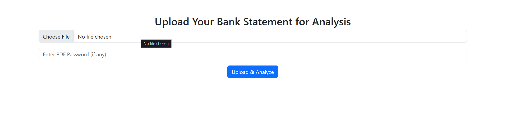
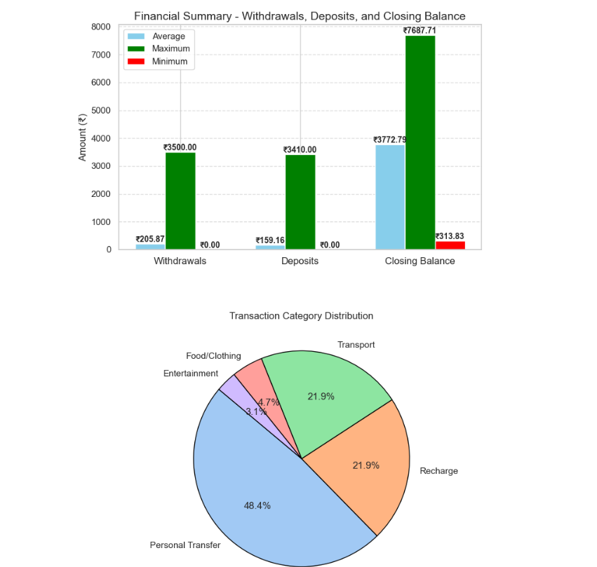
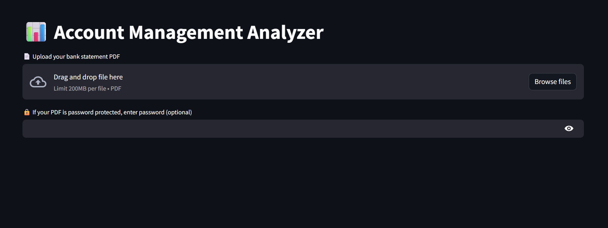
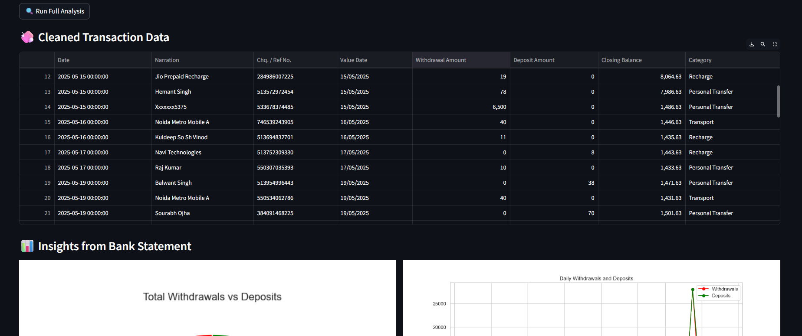

<h1 align="center">Spendify</h1>
<h4 align="center">🤖 AI Account System Manager</h4>

<p align="center">
  An intelligent account data processing and visualization tool built with <b>Flask</b>, <b>Python</b>, and <b>Machine Learning</b>.
</p>

<p align="center">
  
  
  
</p>

---

## 🧠 Overview

This project is a smart **Account System Manager AI** that allows users to upload financial/account-related datasets. It processes data using machine learning, generates insights, and displays interactive visualizations using a Flask web interface.

---

## 🚀 Key Features

✅ **Automatic File Upload Handling**  
✅ **Data Preprocessing & Cleaning**  
✅ **Graph Generation with Matplotlib**  
✅ **Flask Web Interface** (`index.html`, `result.html`)  
✅ **Interactive Visual Reports**  
✅ **Machine Learning Model for Analysis**  
✅ **Organized File System** (uploads, processed data, static graphs)  
✅ **Real-time Feedback on Results**

---

## 🌐 Web App Workflow

1. 📁 Upload a CSV file from the UI.
2. 🧠 AI model processes the data & generates predictions.
3. 📊 Graphs and data summaries are created and stored.
4. 🌐 Results are shown on a user-friendly results page.

---

## 📁 Folder Structure


```bash
├── main.py                 # Main Flask app with AI logic
├── processed/              # Processed data storage
├── static/
│   └── graphs/             # Plots generated by matplotlib
├── templates/
│   ├── index.html          # Home page for file upload
│   └── result.html         # Displays predictions and graphs
└── uploads/                # Stores user-uploaded CSV files

```
---


## 🛠️ Tech Stack

- **Backend**: Flask, Python, Streamlit
- **ML & Data**: pandas, numpy, scikit-learn
- **Frontend**: HTML5, Jinja2 Templates, Bootstrap
- **Visualization**: matplotlib

---

## 📷 UI Snapshots 


| Upload Interface | Result View |
|------------------|-------------|
|  |  |

---

## UI snaps from Streamlit

| Upload Interface | Result View |
|------------------|-------------|
|  |  |

---

## ⚙️ Installation Guide

### 1️⃣ Clone the Repo

```bash
git clone https://github.com/your-username/account-system-manager-ai.git
cd account-system-manager-ai
```

---
⭐️ Star this repo
🍴 Fork to your GitHub
📢 Share with friends
